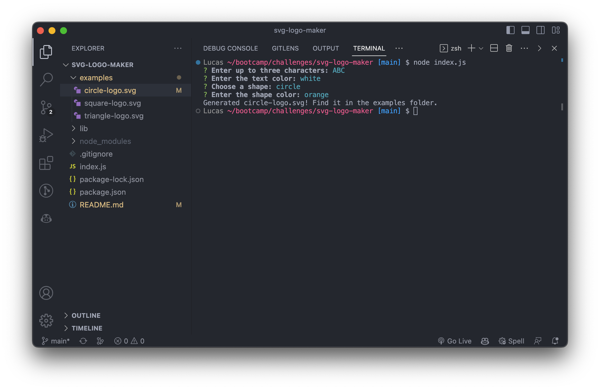
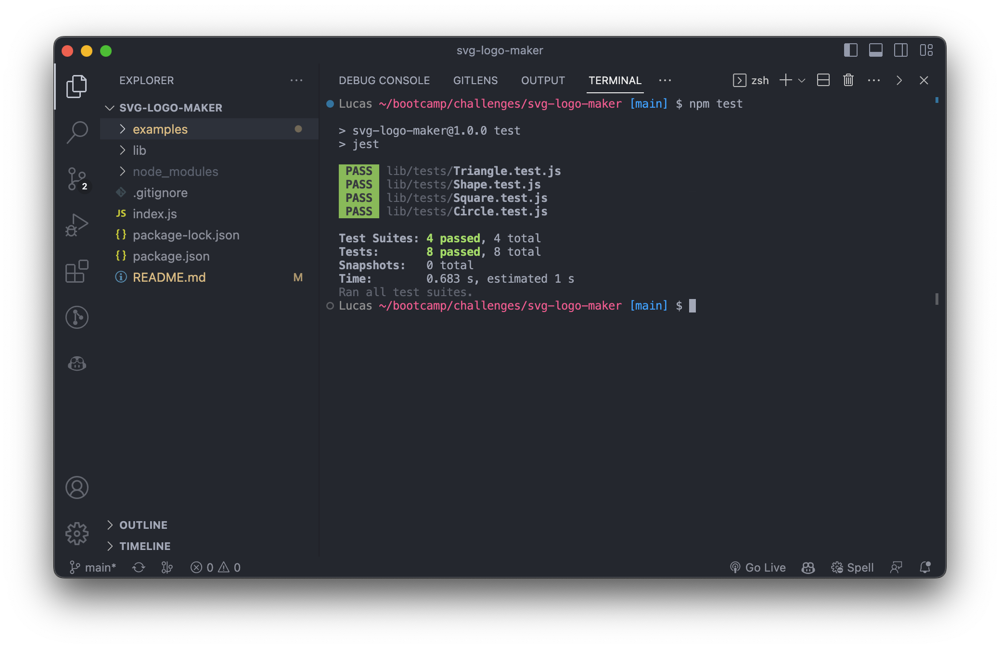

# SVG Logo Maker
## Description

## Installation
To install, simply clone this repo to your local:
```bash
git clone https://github.com/skywalkah/svg-logo-maker.git
```
## Usage
1. Enter to the **svg-logo-maker** folder.
```bash
cd svg-logo-maker
```
2. Run the following command in your terminal
```bash
node index.js
```
Follow the prompts to generate an SVG logo. After entering all the info, the svg file will be created inside the **examples** folder.
## What it should look like

## Testing
Run the following command in your terminal
```bash
npm test
```
Tests should pass and you should see this:

## Video recording
[Video saved in Google Drive](https://drive.google.com/file/d/1NUuEPccYewk6BmbH0X6IiY42vACjngDz/view)
## Credits
N/A
## License
MIT license - Please refer to the LICENSE in the repo for more info.